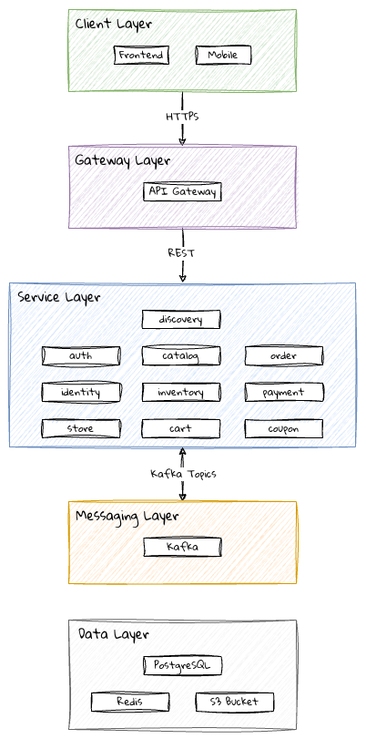

# 🛒 E-Commerce Platform

Plataforma de e-commerce **multi-tenant** baseada em microsserviços, permitindo que múltiplas marcas operem de forma isolada sobre uma única infraestrutura compartilhada.

---

## Índice

- [Visão Geral](#visão-geral)
- [Arquitetura](#arquitetura)
- [Microsserviços](#microsserviços)
- [Comunicação entre Serviços](#comunicação-entre-serviços)
- [Autenticação e Autorização](#autenticação-e-autorização)
- [Stack Tecnológica](#stack-tecnológica)
- [Estrutura do Projeto](#estrutura-do-projeto)
- [Migrations com Flyway](#migrations-com-flyway)
- [Diagramas](#diagramas)

---

## Visão Geral

Cada marca opera como uma `BaseStore` independente com seus próprios produtos, clientes, pedidos e configurações. O isolamento é feito via `store_id` em todas as tabelas de negócio, resolvido pelo API Gateway a cada requisição.

---

## Arquitetura



---

## Microsserviços

| Serviço | Responsabilidade | Schema | Tabelas |
|---|---|---|---|
| `api-gateway` | Roteamento, validação JWT, injeção de headers | — | — |
| `eureka-server` | Registry e descoberta de serviços | — | — |
| `config-service` | Centralização de configurações | — | — |
| `auth-service` | Login, emissão e renovação de JWT | `auth` | — |
| `store-service` | Gestão de lojas (BaseStore) e configurações | `store` | `tb_base_store` |
| `identity-service` | Clientes, funcionários, roles e verificação de e-mail | `identity` | `tb_customer` `tb_employee` `tb_role` `tb_user_roles` `tb_user_verification` `tb_address` |
| `catalog-service` | Produtos, variantes, categorias e imagens | `catalog` | `tb_product` `tb_product_variant` `tb_product_image` `tb_category` `tb_product_categories` |
| `inventory-service` | Warehouses e estoque | `inventory` | `tb_warehouse` `tb_stock` |
| `cart-service` | Carrinho de compras | `cart` | `tb_cart` `tb_cart_entry` |
| `order-service` | Pedidos, entries e consignments | `order` | `tb_order` `tb_order_entry` `tb_consignment` `tb_consignment_entry` |
| `payment-service` | Pagamentos e integração com gateways | `payment` | `tb_payment` |
| `coupon-service` | Cupons de desconto e controle de uso | `coupon` | `tb_coupon` |

---

## Comunicação entre Serviços

| Tipo | Quando usar | Tecnologia |
|---|---|---|
| Síncrona | Resposta imediata necessária | REST via OpenFeign |
| Assíncrona | Eventos entre serviços | Apache Kafka |

### Tópicos Kafka

| Tópico | Publisher | Consumers |
|---|---|---|
| `order.created` | order-service | inventory-service, payment-service |
| `stock.reserved` | inventory-service | order-service |
| `stock.released` | inventory-service | order-service |
| `payment.confirmed` | payment-service | order-service |
| `payment.failed` | payment-service | order-service, inventory-service |
| `order.confirmed` | order-service | coupon-service |
| `consignment.created` | order-service | (notificações futuras) |
| `coupon.validated` | coupon-service | order-service, cart-service |

### Fluxo de criação de pedido

```
1. customer faz checkout
2. cart-service        →  [order.requested]      →  order-service
3. order-service       →  [order.created]        →  inventory-service
                                                  →  payment-service
4. inventory-service   →  [stock.reserved]       →  order-service
                          + warehouse_id por item
5. order-service cria tb_consignment agrupando itens por warehouse
6. order-service       →  [consignment.created]  →  (notificações futuras)
7. payment-service     →  [payment.confirmed]    →  order-service
                    ou →  [payment.failed]        →  order-service
                                                  →  inventory-service
8. order-service       →  [order.confirmed]      →  coupon-service
```
---

## Autenticação e Autorização

O `auth-service` emite JWTs assinados com **RS256**. O API Gateway valida o token com a chave pública e injeta os claims como headers — os microsserviços nunca acessam o JWT diretamente.

### Fluxo

```
1. POST /auth/login → auth-service emite JWT (RS256, chave privada)
2. Requisições seguintes → Authorization: Bearer <token>
3. API Gateway valida assinatura (chave pública) e injeta headers
4. Microsserviços leem apenas os headers
```

### Headers injetados pelo Gateway

| Header | Conteúdo |
|---|---|
| `X-User-Id` | ID do usuário autenticado |
| `X-Store-Id` | ID da loja resolvida |
| `X-User-Roles` | Roles do usuário |
| `X-User-Email` | E-mail do usuário |

---

## Stack Tecnológica

| Camada | Tecnologia |
|---|---|
| Linguagem | Java 21 |
| Framework | Spring Boot 3.3.x |
| Gateway | Spring Cloud Gateway |
| Service Registry | Spring Cloud Netflix Eureka |
| Configuração centralizada | Spring Cloud Config Server |
| Comunicação síncrona | Spring Cloud OpenFeign |
| Resiliência | Resilience4j (Circuit Breaker) |
| Rastreamento distribuído | Micrometer Tracing + Zipkin |
| Segurança | Spring Security + JWT RS256 |
| Banco de dados | PostgreSQL (1 schema por serviço) |
| Migrations | Flyway |
| ORM | Spring Data JPA |
| Mensageria | Apache Kafka |
| Documentação | SpringDoc OpenAPI 3 |
| Observabilidade | Spring Actuator + Micrometer + Prometheus |
| Testes | JUnit 5 + Testcontainers |
| Padrão arquitetural | Layered Architecture |

---

## Estrutura do Projeto

```
ecommerce-platform/                    
├── eureka-server/
├── config-service/
├── api-gateway/
├── auth-service/
├── store-service/
├── identity-service/
├── catalog-service/
├── inventory-service/
├── cart-service/
├── order-service/
├── payment-service/
├── coupon-service/
```

### Estrutura interna de cada serviço

```
{service}/
└── src/main/
    ├── java/com/platform/{service}/
    │   ├── controller/
    │   ├── service/
    │   ├── repository/
    │   ├── model/
    │   ├── dto/
    │   ├── mapper/
    │   ├── kafka/
    │   │   ├── producer/
    │   │   └── consumer/
    │   ├── config/
    │   └── exception/
    └── resources/
        ├── application.yml
        └── db/migration/
            ├── V1__create_tables.sql
            ├── V2__add_indexes.sql
            └── ...
```

---

## Migrations com Flyway

Cada serviço gerencia seu próprio schema de forma independente. O Flyway executa os scripts automaticamente na inicialização, aplicando apenas os que ainda não foram executados.

### Configuração (`application.yml`)

```yaml
spring:
  flyway:
    enabled: true
    locations: classpath:db/migration
    schemas: order
    baseline-on-migrate: true
```

### Convenção de nomenclatura

```
V{versão}__{descrição}.sql

V1__create_order_tables.sql
V2__create_consignment_tables.sql
V3__add_index_store_id.sql
```

> Scripts já aplicados nunca devem ser alterados — sempre crie um novo arquivo `V{n}`.

---

## Diagramas (Draw.io)

| Página | Nome | Conteúdo |
|---|---|---|
| 1 | `ERD` | Tabelas e relacionamentos |
| 2 | `Architecture` | Camadas, serviços e infraestrutura |
| 3 | `Service Communication` | REST e tópicos Kafka entre serviços |
| 4 | `Class Diagram` | Classes por microsserviço |
